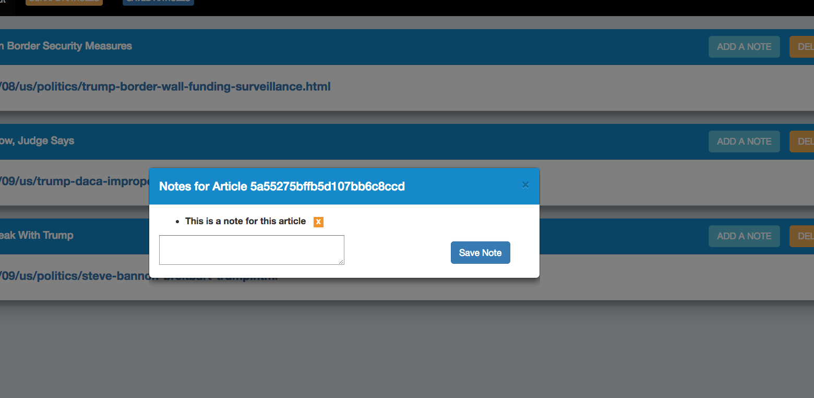

# New York Times Article Scrapper
## by Julian Hasse / January 2018

#### This app allows users to scrape articles from the New York Times website and store them in a no-SQL database (MongoDB).
#### Users can also create, delete, and read notes from each saved article.

### View app live on [Heroku](URL here/)

## Run locally
### Install dependencies
```shell
npm install
```
### Start the server
```shell
node server.js
```
### Open a browser and go to [http://localhost:3000](http://localhost:3000)

## Technologies
### NodeJS, ExpressJS, MongoDB, Mongoose, Handlebars, Cheerio, Request and Morgan.

## Screenshots



